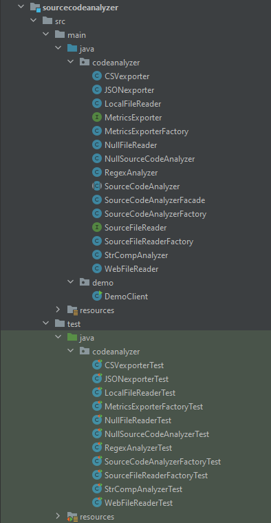
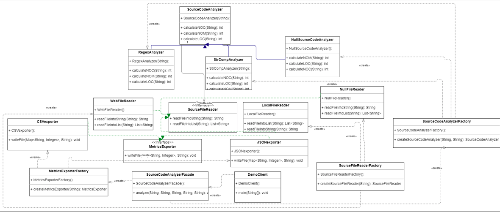

# Lab Assignment #4:Design Patterns

The goal of this assignment is to get familiar with design
principles by refactoring code and applying design
patterns on a given code base.

## Execution

You can execute the system (after building with Maven) with the following
command.

~~~bash

java –jar “jar-with-dependencies” arg0 arg1 arg2 arg3 arg4
arg0 = “JavaSourceCodeInputFile” (e.g., src/test/resources/TestClass.java)
arg1 = “sourceCodeAnalyzerType” [regex|strcomp]
arg2 = “SourceCodeLocationType” [local|web]
arg3 = “OutputFilePath” (e.g., ../output_metrics_file)
arg4 = “OutputFileType” [csv|json]

Example:

java –jar sourcecodeanalyzer/target/sourcecodeanalyzer-0.0.1-SNAPSHOT-jar-with-dependencies.jar sourcecodeanalyzer/src/test/resources/TestClass.java regex local metrics_results csv

~~~

## Project Structure

## Class Diagram

## Solution Description

In the process of refactoring the system to align with the SOLID design principles, the following design patterns are
used:

- **Facade Pattern**

- **Factory Pattern**

- **Strategy Pattern**

- **Null Object Pattern**

- **Bridge Pattern**

### Facade Pattern

The `SourceCodeAnalyzerFacade` class exemplifies the Facade design pattern, which aims to simplify the interaction with
a
complex subsystem by providing a streamlined interface.

By encapsulating the intricate inner workings of subsystems such as `SourceFileReader`, `SourceCodeAnalyzer`, and
`MetricsExporter`, the `SourceCodeAnalyzerFacade` it effectively shields clients
from the complexities of these subsystems, allowing them to leverage the functionality without needing to understand the
inner details.

There are several advantages associated with using the Facade design pattern:

- Simplified Interface: The pattern provides a simple interface that hides the complexities of the subsystem.
  This simplification enhances the usability of the subsystem and makes it easier for clients to interact with.

- Decoupling: The Facade design pattern promotes decoupling between clients and subsystems. By encapsulating the
  subsystems, the pattern reduces direct dependencies between clients and the internal implementation details. This
  decoupling improves modularity and facilitates modifications or extensions to the subsystems without affecting the
  clients.

However, there are also some considerations to keep in mind:

- Limited Flexibility: While the Facade pattern simplifies the subsystem's interface, it may restrict access to certain
  features. If clients require more flexibility and fine-grained control over the subsystem, the simplified interface
  provided by the Facade may not be sufficient.

- Additional Layer: Introducing the Facade class adds an extra layer between the client and the subsystem. This
  additional
  layer can potentially increase complexity or introduce a performance overhead.

### Factory Pattern

The Factory design pattern is employed by the `SourceFileReaderFactory`, `SourceCodeAnalyzerFactory`, and
`MetricsExporterFactory` classes. This pattern addresses the challenge of creating objects without explicitly specifying
their exact classes.

Each factory is responsible for generating a particular type of object based on a string parameter provided.

Some pros and cons of using the Factory design pattern:

Pros:

- Encapsulation: The Factory pattern encapsulates the creation logic within the factories themselves. This approach
  shields client code from the specifics of object creation and promotes loose coupling between the client and concrete
  classes.

- Flexibility: The Factory pattern facilitates the introduction of new product types without disrupting existing client
  code. By relying on the string parameter to determine the object type, new classes can be added to the system, and the
  factories can generate the appropriate objects without requiring changes in client code.

Cons:

- Complexity: If the product types are unlikely to change or the creation process is relatively simple, implementing the
  Factory pattern can add unnecessary complexity to the codebase. In such cases, the pattern might not provide
  significant
  benefits compared to simpler object creation approaches.

- Class Proliferation: The Factory pattern may contribute to an increase in the number of classes within the system.
  This
  proliferation of classes can potentially complicate the code structure and make it more challenging to navigate and
  maintai

### Strategy Pattern

The Strategy pattern is exemplified by the `SourceFileReader`, `SourceCodeAnalyzer`, and `MetricsExporter` classes,
along with
their respective implementations. This pattern facilitates the selection of an algorithm's behavior at runtime, enabling
the algorithm to vary independently of the clients utilizing it.

Some advantages of using the Strategy pattern:

- Flexibility: The Strategy pattern allows for the dynamic selection of algorithms at runtime. This flexibility enables
  clients to switch between different algorithms or behaviors based on changing requirements or user preferences.

- Open for Extension: By employing the Strategy pattern, the system becomes open for extension. New algorithms can be
  easily added without requiring modifications to existing code. This extensibility promotes code reuse and enhances the
  maintainability and scalability of the system.

A disadvantage of using the Strategy pattern:

- Increased Maintenance Effort: Introducing multiple strategies and their corresponding classes can increase the
  maintenance effort. Each strategy may require its own set of code and potential updates. As the number of strategies
  grows, it becomes essential to ensure proper documentation, testing, and maintenance of all strategy implementations.

### Null Object Pattern

The Null Object design pattern is utilized by the `NullMetricsExporter` class and the `NullSourceCodeAnalyzer` class.
This
pattern introduces an object that serves as a substitute for the absence of an object of a specific type.

Pros:

- Eliminates Null Checks: By implementing the Null Object pattern, the need for repetitive null checks in client code is
  eliminated. Clients can rely on the presence of a valid object rather than constantly checking for null references.

- Consistency: The Null Object pattern provides a consistent approach to handling null values and real objects. Clients
  can treat null objects and actual objects in a uniform manner, leading to more predictable and maintainable code.

Cons:

- Complexity: If the product types are stable or the creation process is relatively simple, employing the Null Object
  pattern can introduce unnecessary complexity to the codebase. In such cases, the pattern might not provide significant
  benefits compared to simpler approaches to handle null values.

- Hidden Errors:  Since the null object behaves similarly to real objects, errors related to null values may go
  unnoticed, potentially leading to unexpected behavior.

- Class Proliferation: The increased number of classes can complicate the code structure and make it harder to navigate
  and maintain,
  especially if the number of null object implementations grows excessively

## Bridge Pattern

The Bridge design pattern is applied by the `SourceCodeAnalyzer` abstraction and its implementations, `RegexAnalyzer`
and
`StrcompAnalyzer`, which are the refined abstractions, with the `SourceFileReader` and its
implementations `WebFileReader` and `LocalFileReader`, which are the concrete
implementations. This
pattern separates the abstraction (interface) from its implementation, allowing them to vary
independently.

Pros:

- Decoupling: The Bridge pattern decouples the abstraction (interface) from its implementation classes. This separation
  allows changes in either the abstraction or the implementation to occur independently, without affecting each other.
  It
  promotes flexibility and reduces the dependencies between the two.

- Open for Extension: By employing the Bridge pattern, the system becomes open for extension. New abstractions and
  implementations can be introduced without modifying existing code. This extensibility allows for the addition of new
  features or variations without disrupting the existing functionality.

Cons:

- Complexity: If the product types are unlikely to change or the creation process is relatively simple, implementing the
  Bridge pattern may introduce unnecessary complexity to the codebase. In such cases, the pattern might not provide
  significant benefits compared to simpler approaches that directly couple the abstraction with the implementation.

- Class Proliferation: Utilizing the Bridge pattern can lead to an increase in the number of classes within the system.
  The introduction of abstraction and implementation classes may complicate the code structure, especially if the number
  of variations and combinations grows excessively.